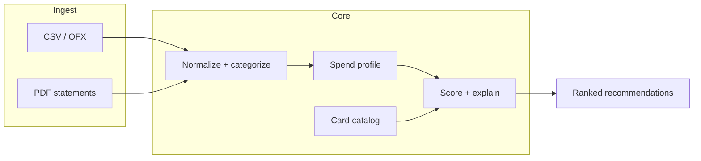

# Card Fit — credit card match from spending history

A **privacy-first** tool that helps someone discover **which credit card products fit their actual spending** by analyzing **past transactions or statement exports** (CSV/PDF), then scoring cards against inferred category mix and reward rules.

**Phases 1, 2, and 4 are implemented** (Phase 3 cloud sync skipped by design). CSV + PDF statement **text extraction in-browser** (`pdfjs-dist`, worker bundled), **heuristic line parser** (`src/lib/statementParse.js`), **editable review table** before data joins the CSV pipeline, then the same analysis as Phases 1–2. Issuer-specific PDF layouts vary — users fix rows in the table. **Live bank linking** remains out of scope.

## Problem

Card marketing highlights headline multipliers (e.g. 3% on dining) but ignores **your** mix of groceries, travel, gas, and online spend. Users want: “Given how I actually spend, which new card is worth applying for?”

## Product principles

1. **Local-first by default** — Parsed data stays in the browser (or optional self-hosted backend). No financial data should be required to hit a third-party API unless the user explicitly opts in.
2. **Transparent scoring** — Show *why* a card ranks: category weights, caps, annual fees, and assumptions (e.g. “we assumed dining = 12% of your spend”).
3. **Not financial advice** — Disclaimers: approval odds, credit impact, and issuer rules (e.g. Chase 5/24) are out of scope for v1 or surfaced only as **educational** notes with clear uncertainty.

## Architecture (target)

| Layer | Role |
|--------|------|
| **Ingest** | CSV upload; PDF → text via PDF.js → heuristic transaction lines → user review → same as CSV. |
| **Normalize** | Map merchant strings → categories (ML or rules + small taxonomy: dining, grocery, travel, gas, etc.). |
| **Profile** | Compute spend distribution, monthly cadence, international vs domestic if detectable. |
| **Card catalog** | Curated JSON/DB of cards: issuer, annual fee, category bonuses, caps, transfer partners. Updated manually or via licensed data later. |
| **Scoring** | For each card, estimate **net reward value** (optionally user-selectable point valuation), subtract fee, apply caps; rank with explainable breakdown. |
| **UI** | Upload → profile summary → ranked cards → detail drawer per card. |



## Roadmap

### Phase 0 — Demo shell (done)

- Portfolio-integrated Vite app; superseded by Phase 1 interactive flow.

### Phase 1 — MVP (local, CSV-only) (done)

- **CSV:** Papa Parse + header normalization; **Amount** column preferred over separate Debit/Credit when both exist.
- **Column mapping** UI: single amount column or Debit/Credit pair; description + optional date.
- **Categories:** layered rules in `src/lib/categorize.js` — ordered regexes per category, then **longest-first substring dictionary** in `src/lib/merchantSnippets.js` (hundreds of merchant phrases), then Amazon/Walmart fallbacks. Overrides still win.
- **Catalog:** `src/data/cards.js` — ~15 US cards with documented effective rates (educational).
- **Scoring:** `src/lib/score.js` — net annual estimate = Σ(spend × category rate) − annual fee; per-card breakdown in UI.
- **Web Worker:** `src/analysis.worker.js` runs parse + categorize + rank off the main thread.
- **Export:** summary JSON (totals, category mix, top 5 cards) — no raw transaction strings.

### Phase 2 — Accuracy and trust (done)

- **Merchant overrides:** keyed by `normalizeMerchantKey` in `src/lib/categorize.js`; table UI + **Auto** to clear; re-runs worker/sync with merged overrides.
- **Break-even:** `src/lib/breakEven.js` — shortfall vs fee; additional annual/monthly spend at **best category rate**; optional **marginal** uplift vs `defaultRate` (illustrative).
- **Charts:** fee vs gross rewards horizontal bars in each expanded card row (`annualFee > 0`).
- **Rules:** more dining/grocery/entertainment keywords in `categorize.js`.
- **Export:** `schemaVersion: 2`, `merchantOverrideCount`, `feeBreakEven` on top cards — still no raw transaction strings.

### Phase 3 — Optional cloud (skipped)

- Not implemented; local-first only unless you add this later.

### Phase 4 — Statement PDFs (done)

- **`src/lib/pdfExtract.js`:** PDF.js text extraction (`hasEOL` line breaks when present); **dynamic import** so the large worker chunk loads only when a PDF is chosen.
- **`src/lib/statementParse.js`:** Regex heuristics for `date + description + amount` lines; skips obvious statement headers and payment lines.
- **UI:** Review table (edit, delete, add row) → `Papa.unparse` → existing `loadCsv` / column mapping / analysis.
- **Limits:** Not issuer-specific templates — accuracy depends on how cleanly the PDF exposes text. CSV export from the bank remains the most reliable path.

### Non-goals (near term)

- Real-time bank linking (Plaid, etc.) — high compliance burden; revisit if product justifies it.
- Application funnel or affiliate revenue without legal/compliance review.

## Privacy and compliance notes

- Treat uploads as **sensitive**; clear in UI that data is processed locally unless documented otherwise.
- Avoid storing full account numbers; strip obvious PII in logs.
- If you ever ship cloud features: encryption, retention policy, and regional compliance become mandatory design inputs.

## Local development

```bash
npm install --prefix projects/card-fit
npm run dev --prefix projects/card-fit
```

Open port **5178**, or from the portfolio root: `npm run dev:all` and visit `/card-fit/`.

## Production build

```bash
npm run build --prefix projects/card-fit
```

Static output is suitable for GitHub Pages when copied into the main site’s `dist/card-fit/` via `npm run build:all` from the repo root.
